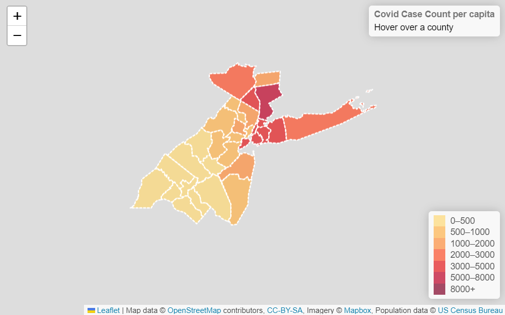
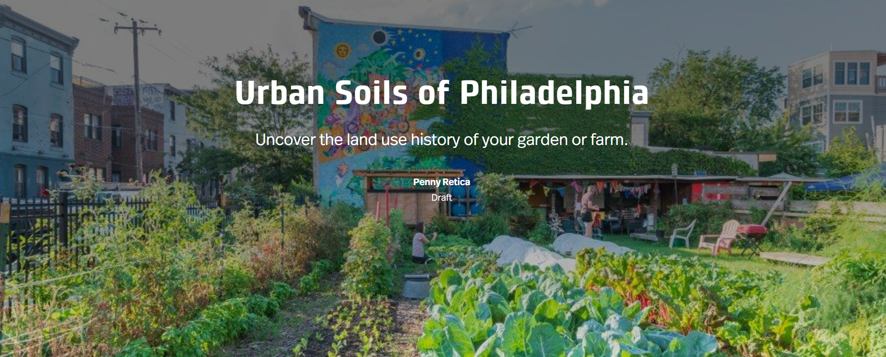

<html>
  <head>
    <title>Penny Retica</title>
    <link rel="stylesheet" href="style.css">
  </head>
  <body>
    <header>
      <nav>
        <ul>
          <li><a href="#about">About</a></li>
          <li><a href="#portfolio">Portfolio</a></li>
          <li><a href="#contact">Contact</a></li>
        </ul>
      </nav>
    </header>
    <main>
      <section class="hero">
        <h1>Penny Retica</h1>
        
Building insightful spatial analysis of the inner workings of our cities and public spaces.

        <a href="#about" class="button">Learn More</a>
      </section>
      <section class="about">
        <h2>About</h2>
        
Studied Peace and Conflict Studies at Swarthmore College for three years; graduating with accelerated B.A. in Geography and Urban Studies from Temple University.     Special interest in public spaces, community land tenure in cities across the U.S., and applications of GIS to fields of horticulture and urban agriculture.

        <a href="https://pbretica.github.io/Retica_2023CV.pdf" class="button2">CV</a>
        <a href="https://www.linkedin.com/in/penny-retica/" class="button2">LinkedIn</a>
      </section>
      <section class="portfolio">
        <h2>Portfolio</h2>
        
 Skilled in ESRI Suite, ArcGIS Story Maps, JS, Python, R, JMP, MS Office, MapBox, Leaflet, and more.     Strong background in research and project design.    
        A quick look at what I'm working on: 

        

        <a href="https://pbretica.github.io/choropleth/" class="button2">Launch Choropleth Map</a>
        <h3> Interactive choropleth map. <i>PA scale.</i>   Visualizes distribution of covid cases across all PA counties.</h3>
        
        <h4> Screen capture of choropleth map.</h4>
        

        <a href="https://pbretica.github.io/worldcoviddeaths/" class="button2">Launch Proportional Symbol Map</a>
        <h3>Interactive proportional symbol map (embedded below). <i>Global scale.</i>   Conveys magnitude of covid death counts around the world through color-coded proportional symbols.</h3>
        <iframe src="https://pbretica.github.io/worldcoviddeaths/" height="500" width="600"></iframe>
        <h4> Embedded proportional symbol map. </h4>
        

        <a href="" class="button2">Launch Site History Project</a> <b> <strong> Coming soon! </strong> </b>
        <h3>Creating a comprehensive site history guide for urban growers in Philadelphia using free online resources. <i>Philadelphia scale.</i>   
        Presented in ArcGIS Story Maps and downloadable pdf guides.
        Includes research on land tenure policy in Philadelphia and map tour of historic community growing spaces.     Based on research with Penn State Extension Urban Soils Community Engagement Team. Working with Map Collections of the Free Library on collaborative educational workshop open to the public. </h3>
        
        <h4> Screen capture of ArcGIS Story Map. </h4>
        

      </section>
      <section class="contact">
        <h2>Contact</h2>
        
Email me at pbretica@gmail.com. 

      </section>
    </main>
    <footer>
      
&copy; 2023 Penny Retica

    </footer>
  </body>
</html>
